# Grocery Delivery Apps

A simple grocery and food delivery application built as a local portfolio demo. The project includes a customer-facing ordering app, an admin panel, and an Express.js REST API connected to MongoDB.

This repository is intended to demonstrate common delivery app flows such as product browsing, cart management, checkout simulation, order history, admin product management, and order status updates.

## Project Overview

Grocery Delivery Apps is split into three main applications:

- `backend` - Express.js API with MongoDB/Mongoose
- `frontend` - React + Vite customer app
- `admin` - React + Vite admin panel

The app is designed for local development and portfolio presentation. It includes demo checkout mode through `PAYMENT_MODE=demo`, so orders can be placed without processing a real payment.

## Tech Stack

### Backend

- Node.js
- Express.js
- MongoDB Atlas
- Mongoose
- JSON Web Token authentication
- Multer for image uploads
- Stripe package structure for payment flow

### Customer Frontend

- React
- Vite
- React Router
- Axios

### Admin Panel

- React
- Vite
- React Router
- Axios
- Bootstrap
- React Toastify

## Key Features

### Customer App

- Product listing
- Add to cart
- Cart page
- Checkout page
- Demo checkout mode
- My Orders page
- Order tracking/status updates after admin changes order status

### Admin Panel

- Admin login
- Admin token authentication
- Add product
- Product list
- Remove product
- Orders list
- Update order status

### Backend

- REST API
- MongoDB Atlas connection
- Customer authentication
- Cart API
- Food/product API
- Order API
- Admin authentication
- Protected admin endpoints
- Demo checkout mode with `PAYMENT_MODE=demo`

## Project Structure

```text
grocery-delivery-apps/
+-- admin/       # React + Vite admin panel
+-- backend/     # Express.js + MongoDB API
+-- docs/        # Portfolio screenshots
+-- frontend/    # React + Vite customer app
+-- README.md
```

## Screenshots

### Customer Home

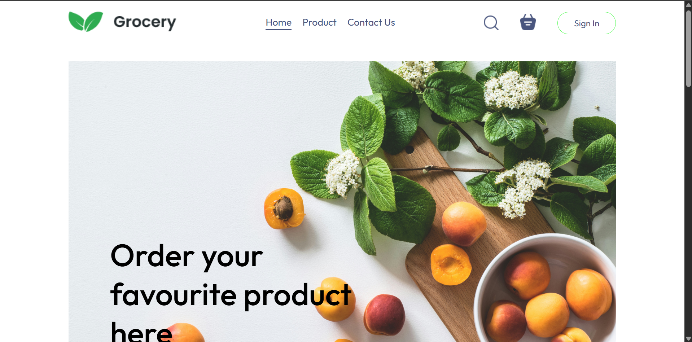

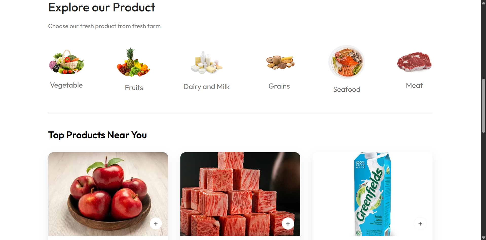

### Customer Product Flow

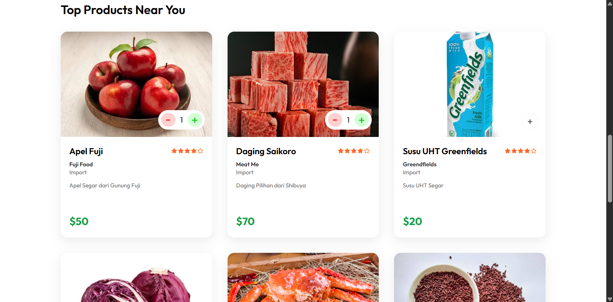

### Customer Cart and Checkout

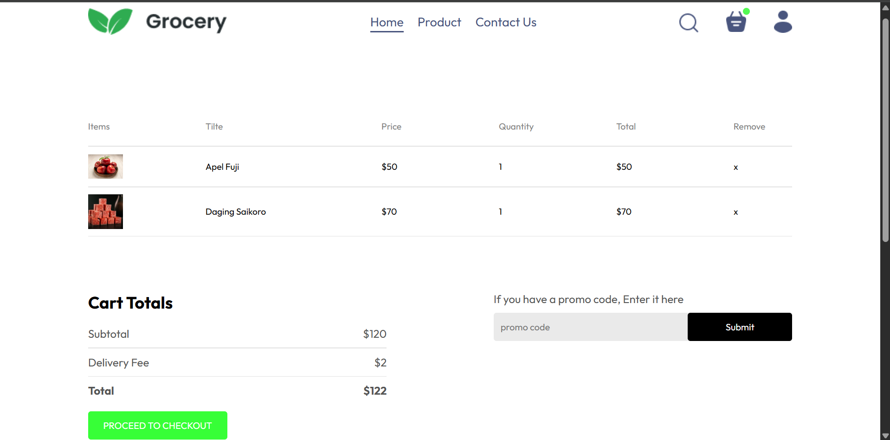

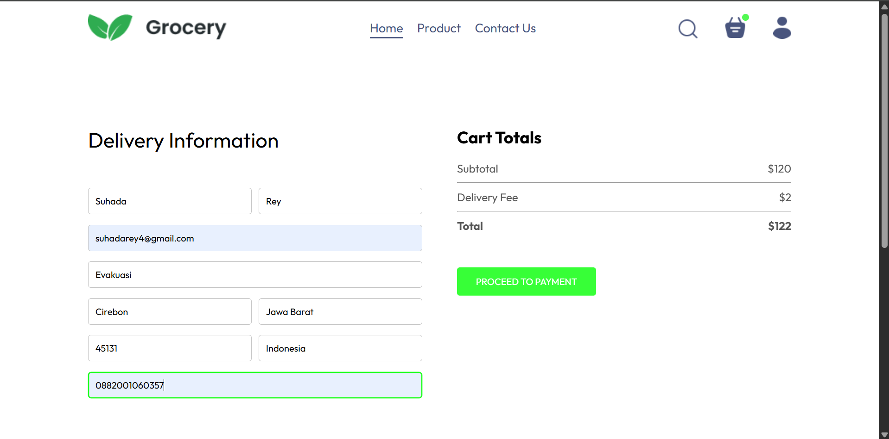

### Customer Orders

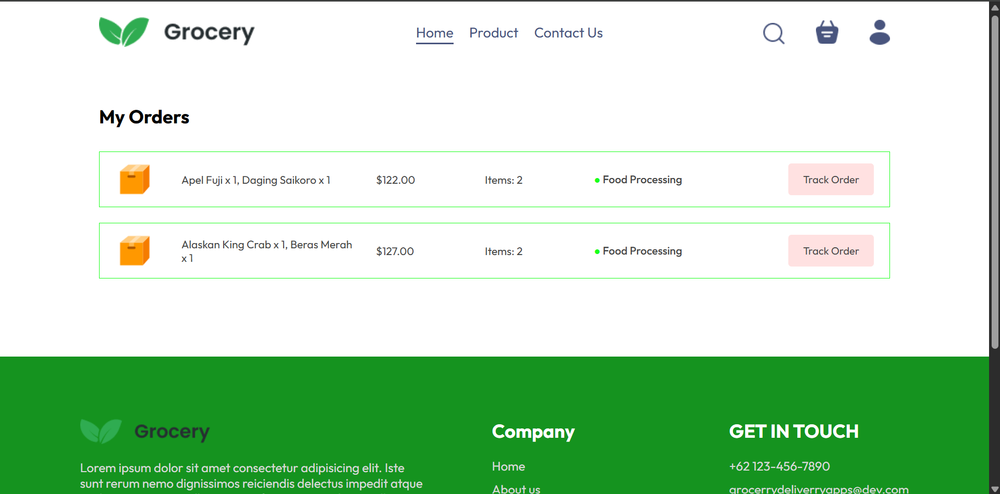

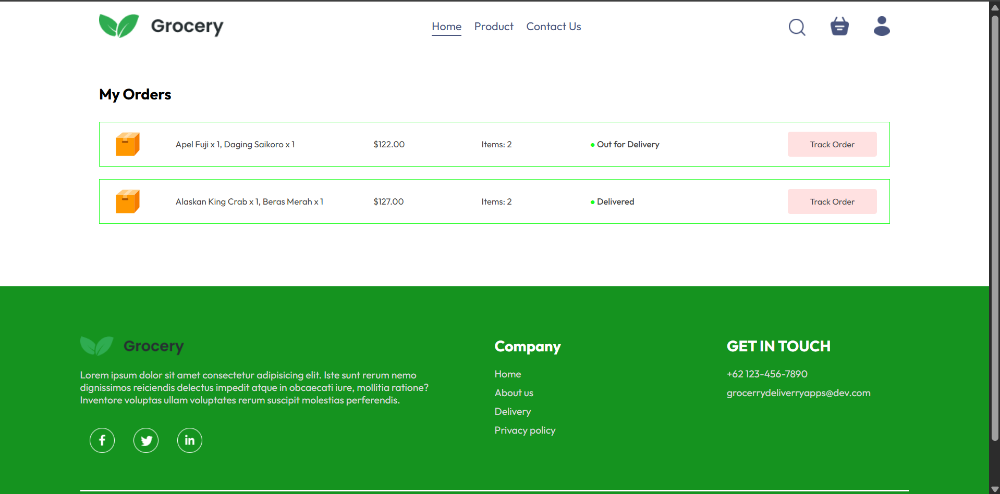

### Admin Authentication

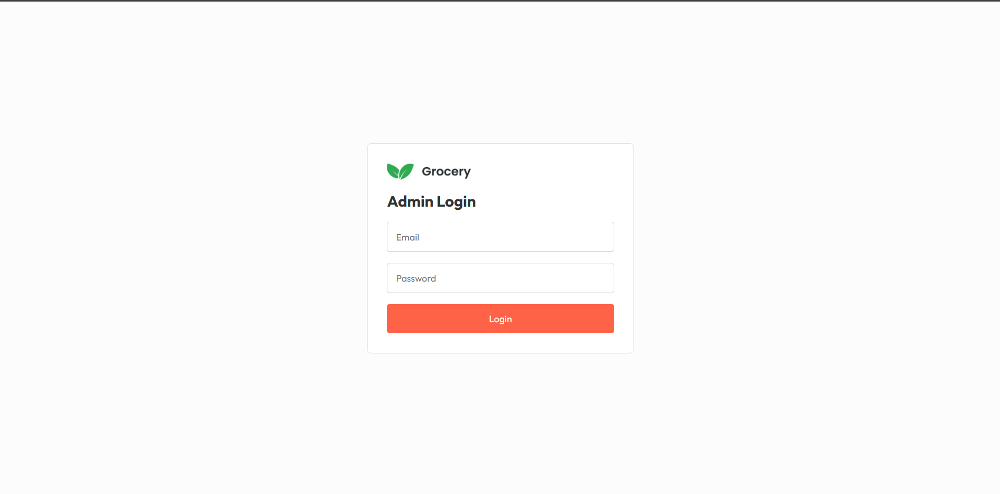

### Admin Product Management

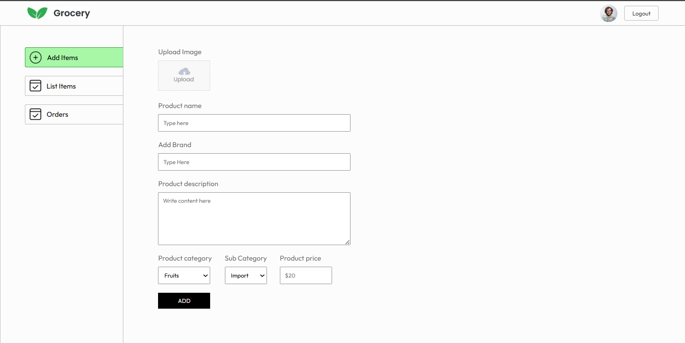

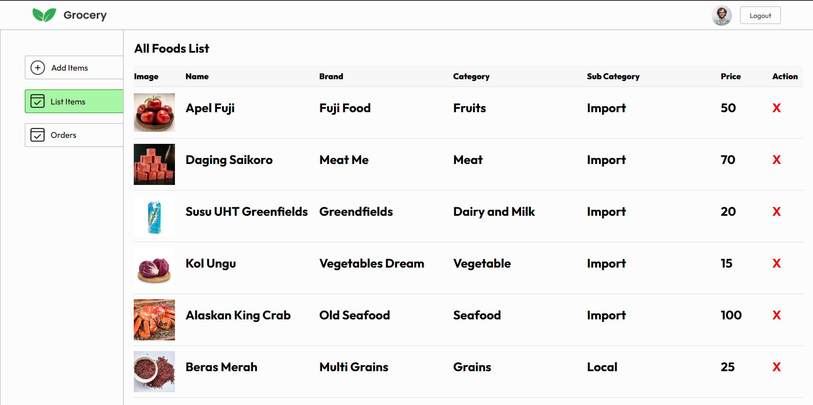

### Admin Orders

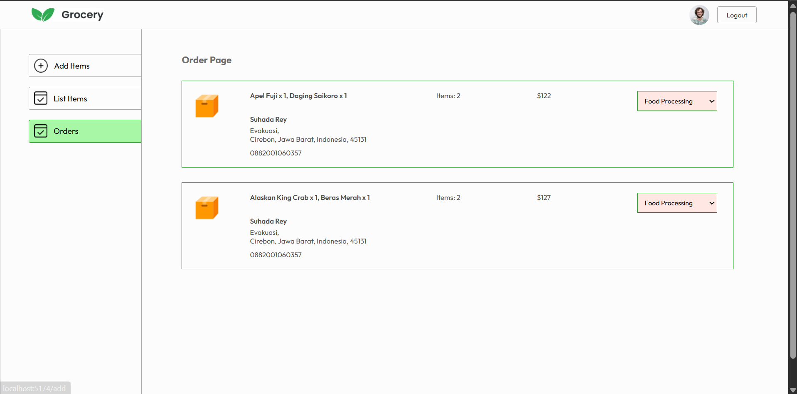

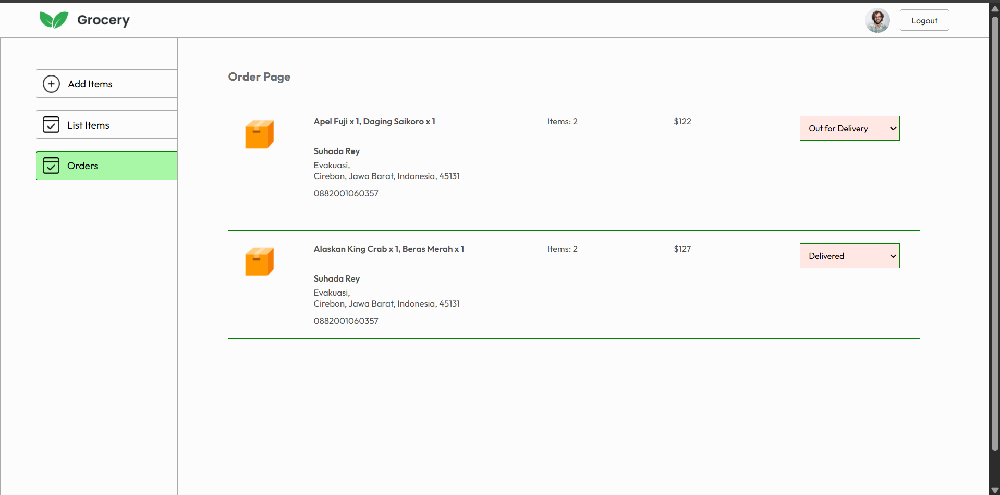

## Environment Variables

Create a `.env` file inside each app folder as needed. Do not commit real secrets or production credentials.

### Backend `.env` Example

```env
PORT=4000
MONGO_URI=your_mongodb_connection_string
JWT_SECRET=your_local_jwt_secret

ADMIN_EMAIL=admin@deliveryapps.local
ADMIN_PASSWORD=admin123

PAYMENT_MODE=demo
STRIPE_SECRET_KEY=
FRONTEND_URL=http://localhost:5173
```

### Frontend `.env`

```env
VITE_API_URL=http://localhost:4000
```

### Admin `.env`

```env
VITE_API_URL=http://localhost:4000
```

## Local Setup

Clone the repository and install dependencies for each application.

```bash
git clone <repository-url>
cd grocery-delivery-apps
```

Install backend dependencies:

```bash
cd backend
npm install
```

Install customer frontend dependencies:

```bash
cd ../frontend
npm install
```

Install admin panel dependencies:

```bash
cd ../admin
npm install
```

## Running The Project

Start the backend API:

```bash
cd backend
npm run server
```

Backend runtime:

```text
http://localhost:4000
```

Start the customer frontend:

```bash
cd frontend
npm run dev
```

Customer frontend runtime:

```text
http://localhost:5173
```

Start the admin panel on port `5174`:

```bash
cd admin
npm run dev -- --port 5174
```

Admin panel runtime:

```text
http://localhost:5174
```

## Demo Admin Account

For local demo only:

```text
Email: admin@deliveryapps.local
Password: admin123
```

These credentials are example values for a local portfolio demo. They are not production credentials and should be changed for any real deployment.

## Demo Checkout Mode

This project uses `PAYMENT_MODE=demo` for local portfolio testing.

When demo mode is enabled:

- Checkout simulates a successful payment.
- The user is redirected to My Orders after checkout.
- The order appears in Admin Orders.
- Admin can update the order status.
- The customer can see the updated order status in My Orders.

The Stripe package and payment flow structure are present, but production-ready Stripe verification and webhook handling have not been implemented yet.

## API Overview

Base URL:

```text
http://localhost:4000
```

Main endpoints:

| Method | Endpoint | Description |
| --- | --- | --- |
| `GET` | `/` | API health check |
| `POST` | `/api/user/register` | Register customer account |
| `POST` | `/api/user/login` | Login customer account |
| `GET` | `/api/food/list` | Get product list |
| `POST` | `/api/food/add` | Add product, protected admin endpoint |
| `POST` | `/api/food/remove` | Remove product, protected admin endpoint |
| `POST` | `/api/cart/add` | Add item to customer cart |
| `POST` | `/api/cart/remove` | Remove item from customer cart |
| `POST` | `/api/cart/get` | Get customer cart |
| `POST` | `/api/order/place` | Place customer order |
| `POST` | `/api/order/verify` | Verify order/payment flow |
| `POST` | `/api/order/userorders` | Get customer orders |
| `GET` | `/api/order/list` | Get all orders, protected admin endpoint |
| `POST` | `/api/order/status` | Update order status, protected admin endpoint |
| `POST` | `/api/admin/login` | Login admin account |
| `GET` | `/images/:filename` | Serve uploaded product images |

Customer endpoints use customer JWT authentication where required. Admin endpoints use admin token authentication where required.

## Known Limitations

- Demo checkout mode is used for local portfolio testing.
- Stripe webhook verification is not implemented yet.
- Admin credential is configured through environment variables.
- Tokens are stored in `localStorage` for local demo simplicity.
- CORS is still open for local development.
- This project is not production-hardened yet.

## Future Improvements

- Stripe webhook integration
- Role-based admin management
- Stricter CORS configuration
- Better order tracking UI
- Image storage using cloud storage
- Deployment configuration
- Improved validation and error handling

## Author

Raihan Achmad Suhada
